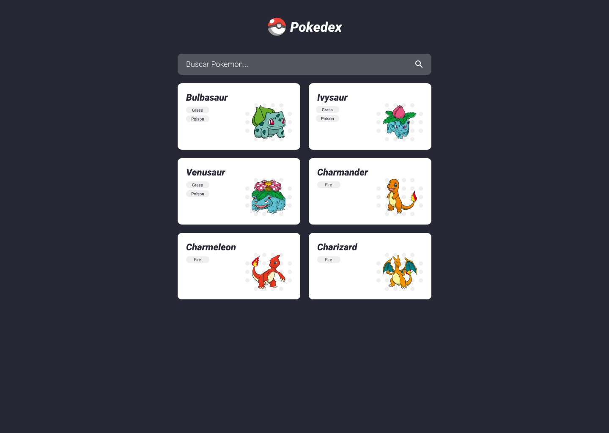

# Pokedex




> O Pokedex exibe uma lista de pokemons contendo suas imagens, nomes e tipos. E caso você queira ver mais sobre algum pokemon você só precisa clicar sobre ele que abrirá uma página com mais detalhes sobre o mesmo.

### Ajustes e melhorias

O projeto ainda está em desenvolvimento e as próximas atualizações serão voltadas nas seguintes tarefas:

- [] Adicionar tema escuro(Dark Theme)
- [] Adicionar testes unitários
- [] Adicionar página de comparação entre dois pokemons

## 💻 Pré-requisitos

Antes de começar, você vai precisar ter instalado em sua máquina as seguintes ferramentas:
[Git](https://git-scm.com), [Node](https://nodejs.org/) e [AngularCLI](https://angular.io/cli).
Além disto é bom ter um editor para trabalhar com o código como o [VSCode](https://code.visualstudio.com/).

#### 🎲 Clonando o repositório e instalando as dependências

```bash
# Clone este repositório
$ git clone https://github.com/pedromm65/Pokedex.git
# Acesse a pasta do projeto web no terminal/cmd
$ cd Pokedex
# Instale as dependências web
$ npm install
```

## ☕ Usando <Pokedex>

Para usar <Pokedex>, siga estas etapas:

```
# Acesse a pasta do projeto pelo terminal
$ cd Pokedex

# Execute a aplicação
$ npm run start

# O servidor inciará na porta:4200 - acesse http://localhost:4200/
```

## 📫 Contribuindo para <Pokedex>

Para contribuir com <Pokedex>, siga estas etapas:

1. Bifurque este repositório.
2. Crie um branch: `git checkout -b <nome_branch>`.
3. Faça suas alterações e confirme-as: `git commit -m '<mensagem_commit>'`
4. Envie para o branch original: `git push origin <Pokedex> / <local>`
5. Crie a solicitação de pull.

Como alternativa, consulte a documentação do GitHub em [como criar uma solicitação pull](https://help.github.com/en/github/collaborating-with-issues-and-pull-requests/creating-a-pull-request).

## 🦸 Autor


 <br />
 <sub><b>Pedro Lima</b></sub></a> 🚀
 <br />

[](https://www.linkedin.com/in/pedro-lima-824154231/)
[](pedrohlimadev@gmail.com)

## 😄 Seja um dos contribuidores<br>

Quer fazer parte desse projeto? Clique [AQUI](CONTRIBUTING.md) e leia como contribuir.

## 📝 Licença

Esse projeto está sob licença. Veja o arquivo [LICENÇA](LICENSE.md) para mais detalhes.

[⬆ Voltar ao topo](#nome-do-projeto)<br>
